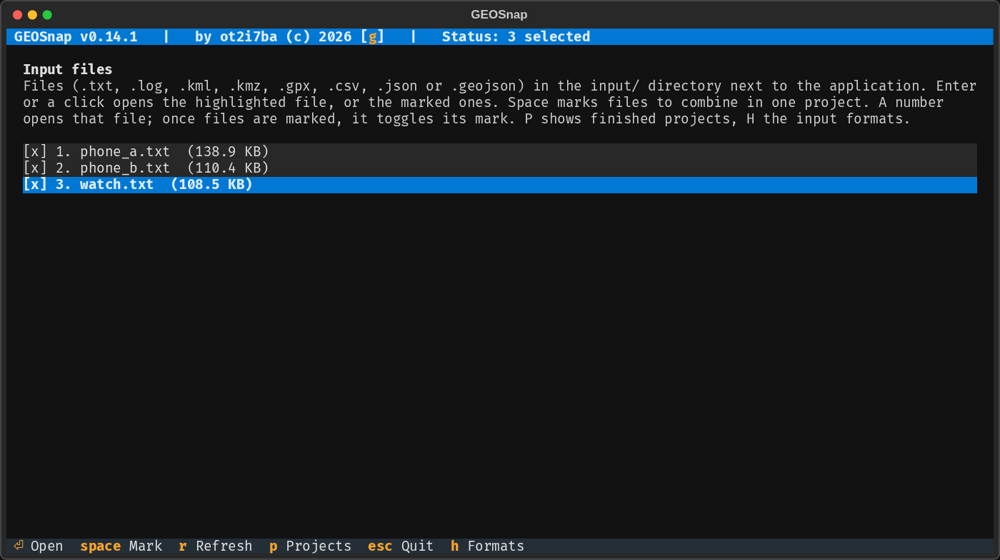
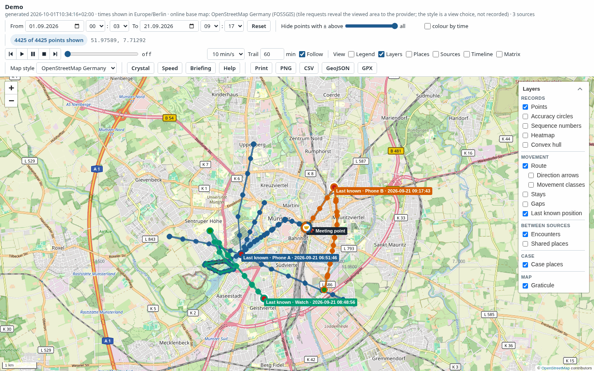
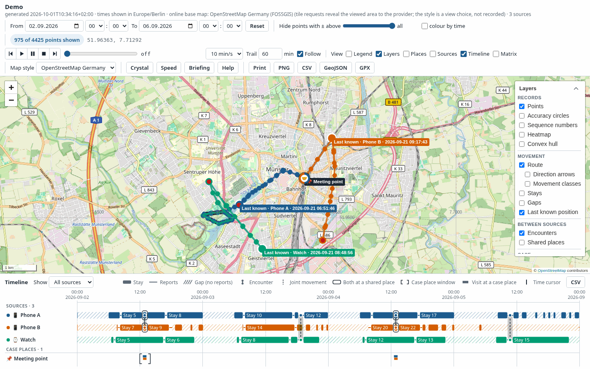
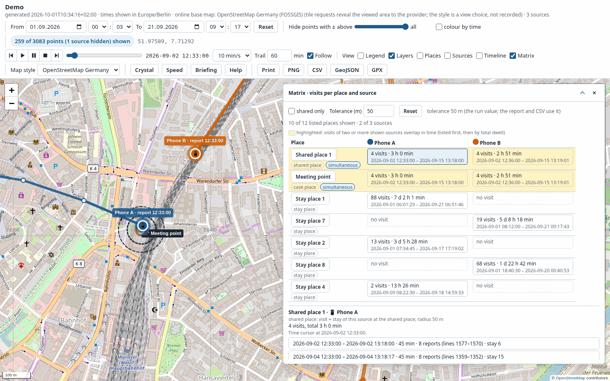
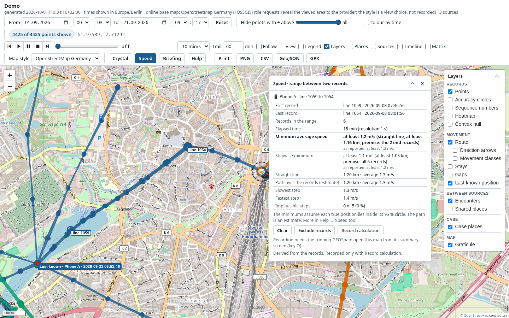
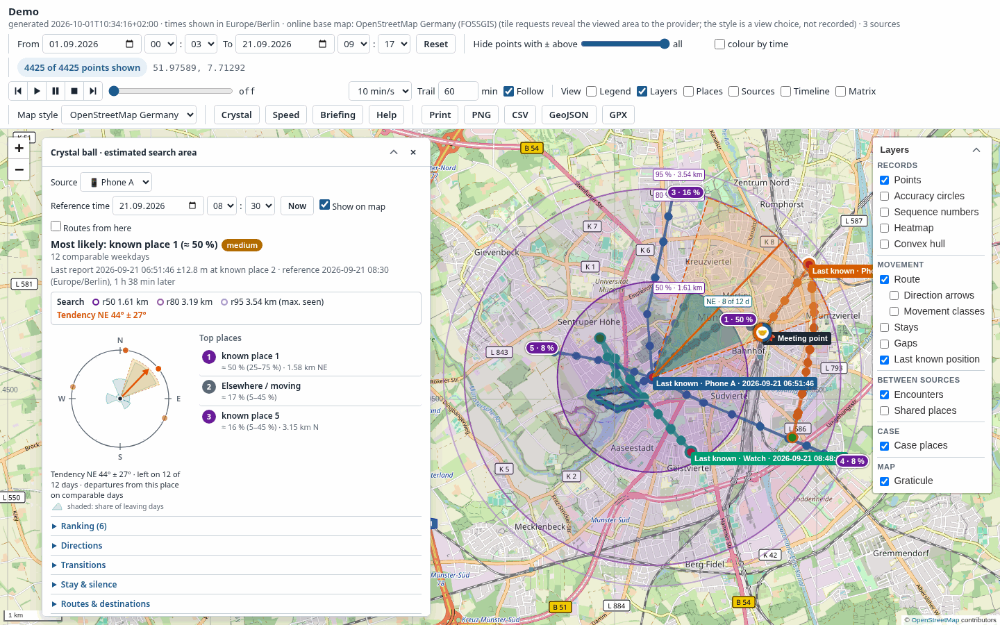

# GEOSnap manual
This manual explains what GEOSnap does and how it does it: which files it reads, what it works out from them, how the map tools arrive at their figures, and what you end up with in the project folder. The [README](README.md) gives the short tour, the build instructions and the licence. This manual is for the moment you want to know why a number is what it is.

> [!NOTE]
> The easiest way to use GEOSnap is the compiled `GEOSnap.exe` from the [releases page](https://github.com/ot2i7ba/GEOSnap/releases). It needs no Python installation, no packages and no build step, and it is the version I test on Windows 11. Running from source works just as well and is described in the README.

> [!IMPORTANT]
> Everything GEOSnap shows is based on the positions a **device reported**, with the accuracy the device stated. It never shows where a person was. Between two records nothing is known, and a gap in the records does not mean the device was somewhere else. Keep this in mind when you read any result, and especially the crystal ball, which is an estimate and not a finding.

## Table of Contents
- [Getting started](#getting-started)
- [A typical workflow](#a-typical-workflow)
- [Input formats](#input-formats)
  - [At a glance](#at-a-glance)
  - [Text files](#text-files)
  - [KML and KMZ](#kml-and-kmz)
  - [GPX](#gpx)
  - [CSV](#csv)
  - [GeoJSON](#geojson)
  - [Google location exports](#google-location-exports)
  - [Records without a timestamp](#records-without-a-timestamp)
- [Accuracy and positioning method](#accuracy-and-positioning-method)
- [Working with several sources](#working-with-several-sources)
- [What GEOSnap works out](#what-geosnap-works-out)
- [Case places](#case-places)
- [The map](#the-map)
- [The timeline](#the-timeline)
- [The presence matrix](#the-presence-matrix)
- [The speed tool](#the-speed-tool)
- [The crystal ball](#the-crystal-ball)
- [Places nearby with Overpass](#places-nearby-with-overpass)
- [Recording results from the map](#recording-results-from-the-map)
- [The project folder](#the-project-folder)
- [Report and verification](#report-and-verification)
- [Reopening a finished project](#reopening-a-finished-project)
- [Online services and privacy](#online-services-and-privacy)
- [Configuration](#configuration)
- [Keys](#keys)
- [Browsers](#browsers)

## Getting started
GEOSnap is a terminal application. You do not need to type commands: you move with the arrow keys, mark files with Space and confirm with Enter. Every screen lists its keys in the footer.

On its first start, `GEOSnap.exe` creates three things next to itself:

| Item | Purpose |
|---|---|
| `input\` | Put the files you want to look at here. GEOSnap only ever reads them. |
| `output\` | Every run writes one project folder here, sorted by year and month. |
| `config.toml` | The settings. Every key is explained in the file; see [Configuration](#configuration). |

The map GEOSnap produces is a single HTML file that opens in any current browser (see [Browsers](#browsers)). It embeds everything it needs, so it also works on a computer without internet access; only the background map and live place checks need a connection.

GEOSnap also takes a few command-line options:

| Command | Purpose |
|---|---|
| `GEOSnap.exe` | Start the terminal application |
| `GEOSnap.exe --verify <project folder>` | Check every file of a project against its manifest, its hash chains and the source files |
| `GEOSnap.exe --version` | Print the version |

## A typical workflow
This walk-through follows one project from the files to the analysis. The screenshots in this manual show invented sample data: two phones and a watch, spread over three weeks.

<p align="center">
  
</p>
<p align="center"><em>The file list with three files marked for one project.</em></p>

**1. Collect the files.** Copy the exports into `input\`. They can be of different formats: a KML file from a phone extraction, a GPX track from a watch and a CSV list can go into one project. Press **H** on the file list to see what each format needs.

**2. Choose the files.** Mark every file that belongs to the project with **Space** and press **Enter**. With nothing marked, Enter (or the file's number) opens just the highlighted file. Press **R** to show files you added while GEOSnap is running.

**3. Set up the project.** The setup screen asks for a project name and shows one row per source:

- a **name** (the file name by default), a **type** (smartphone, watch, vehicle and so on) and a **colour**, which identify the source on the map and in every export;
- the **accuracy level** of the source, if you know it (see [Accuracy and positioning method](#accuracy-and-positioning-method));
- for a CSV file, the **Columns…** button. The column dialog opens by itself when GEOSnap needs you to confirm something.

The switch *Remove duplicates from the map* hides repeated reports of the same position on the map; the analysis always uses every record. Above the sources you can fill in a **Case reference** and your name as **Examiner**; both go into the report. **Case places…** lets you enter locations you want every source checked against, with a radius and an optional time window (see [Case places](#case-places)). The run settings at the bottom show the display time zone and the matrix tolerance, and both can be changed for this run without touching `config.toml`.

**4. Run it.** Press **Enter**. GEOSnap reads each file, checks every record, analyses each source and the sources against each other, looks up places nearby if online services are on, and writes the project folder. **Esc** cancels; what was done so far is kept.

**5. Read the summary.** The summary screen lists what was read and rejected, what the analysis found, the files written and their hashes. It also shows the SHA-256 of the manifest.

> [!IMPORTANT]
> Write down the manifest hash shown on the summary screen, for example in your case notes. It is the anchor for every other hash in the project: as long as it matches, you can show that no file of the project has changed.

**6. Open the map.** Press **O**. GEOSnap serves the map on a private local address and opens your browser. Opened this way, live place checks work with the main Overpass server, and you can record search areas and speed calculations into the project (see [Recording results from the map](#recording-results-from-the-map)).

**7. Get your bearings.** Start with the overview: each source in its own colour, the last known position of each, and the encounters between them. The **Briefing** panel gives the key figures, the stays and the gaps per source. Narrow the time with **From** and **To**, switch on **Stays**, **Gaps** or **Movement classes** (which need **Route**) in the layer control, and open the **Timeline** to see all sources on one time axis.

**8. Ask your questions.**

- *Which device was where, and were two of them there at the same time?* Open **View → Matrix** ([The presence matrix](#the-presence-matrix)). Click a cell to jump to the place and the time of the visit.
- *How fast must the device have travelled between these two points?* Click **Speed** and pick the two records ([The speed tool](#the-speed-tool)).
- *Where is the device likely to be now, or at a given time?* Click **Crystal**, choose the source and the reference time ([The crystal ball](#the-crystal-ball)). From the result you can check the surroundings of the most likely places, for example for water, railway lines or shelters ([Places nearby with Overpass](#places-nearby-with-overpass)).

**9. Keep what matters.** **Record search area** and **Record calculation** write the crystal ball estimate or the speed calculation into the project folder, with hashes and a printable sheet. Everything else you do in the map, such as filters and exports, is not recorded.

**10. Hand it over.** Print the report (`report_<stamp>.html`) from the browser to PDF, pass on the project folder, and let the recipient run `GEOSnap.exe --verify` on it. Months later, **P** on the file list reopens the project, verifies it and serves its map again.

## Input formats
### At a glance
GEOSnap decides the format of a file by its suffix and, where the suffix is not enough, by the first bytes of its content. It never guesses a layout: a file it cannot place is refused with a reason.

| Suffix | Format | Recognised by |
|--------|--------|---------------|
| `.txt`, `.log` | `text` | the suffix |
| `.kml` | `kml` | a .kml file that is not a ZIP archive |
| `.kmz`, `.kml` | `kmz` | a .kmz file, or a .kml file that starts with the ZIP signature |
| `.gpx` | `gpx` | the suffix |
| `.csv` | `csv` | the suffix |
| `.geojson`, `.json` | `geojson` | "type": "FeatureCollection" or "type": "Feature" in the first 64 KB |
| `.json` | `google-records` | {"locations": [ at the start of the file |
| `.json` | `google-timeline` | {"semanticSegments", "rawSignals" or "userLocationProfile" |
| `.json` | `google-semantic` | {"timelineObjects" at the start of the file |

A few rules hold for every format:

- **Source files are only read, never changed.** Each one is hashed with SHA-256 while it is read, and the hash goes into the report and the manifest.
- **Every rejected record is kept**, with its reason, in `rejected_<stamp>.csv`. Nothing disappears silently.
- **Coordinates are WGS84** latitude and longitude. Positions within 0.001° of 0/0 ("null island", a typical default value) are rejected, and so are times before 1990 or after 2099, which usually mean an unset clock.
- **The original record travels with every point.** The tooltip and `points_<stamp>.csv` carry the record as it was read (`original_line`), so you can always go back to the source.
- **Times are compared in UTC.** Local times are shown in the display time zone of the run, with the offset wherever a wall-clock time occurs twice.

Key **H** on the file list shows the same overview in the program, together with a minimal example per format. The overview below is the same text.

#### What key H shows

One entry per format: what GEOSnap reads, what a file must have and what it refuses. The sections after it explain the formats in more detail.

**`.txt`, `.log` — format `text`**

- **Read:** Every record with a latitude, a longitude and a time, also several in one
  line; other text counts as unrelated. The two ± values are the accuracy in metres; the
  whole line is kept as original_line.
- **Required:** A time with its UTC offset in every record. The line number is the
  record number.
- **Refused:** Coordinates out of range or not finite, null island (within 0.001° of
  0/0), a zone name contradicting the offset (+0200 UTC) or the date (+0100 CEST in
  January), non-existent local times, times before 1990 or after 2099, and record-like
  text (± and |) in another layout. A zone abbreviation with several meanings (PDT, EST)
  is read by the offset alone.

**`.kml` — format `kml`**

- **Read:** Placemarks in any Document/Folder nesting: a Point with TimeStamp/when or
  TimeSpan/begin becomes a record, name and description become its label and note, and
  ExtendedData follows in the note as 'name: value' parts. gx:Track yields one record
  per when/coord pair, a MultiGeometry one record per Point. A placemark without a time
  is read without a timestamp.
- **Required:** The root element must be kml, and a placemark needs a position: a Point,
  a gx:Track with as many gx:coord as when elements, or both. The placemark number is
  the record number.
- **Refused:** A DOCTYPE declaration and malformed XML refuse the whole file (no entity
  expansion). Per placemark: an empty when/begin, coordinates that are missing,
  unparsable, out of range or at null island, unparsable times, times before 1990 or
  after 2099, a TimeSpan with an end but no begin, a MultiGeometry with several Points
  but no time, and tracks whose when and coord counts differ. KML reports no accuracy in
  metres.

**`.kmz`, `.kml` — format `kmz`**

- **Read:** The root-level doc.kml if present, else the first .kml entry in archive
  order, decompressed straight into the KML reader; then every KML rule above. Nothing
  is unpacked to disk, so entry names with absolute or parent paths cannot write
  anywhere.
- **Required:** A ZIP archive holding at least one .kml entry.
- **Refused:** As KML, plus an archive without a .kml entry. Further .kml entries are
  not read; their number and first names are given in a warning. Images and other
  entries are ignored.

**`.gpx` — format `gpx`**

- **Read:** wpt, rtept and trkpt elements in document order, GPX 1.0 or 1.1: name
  becomes the label, desc and cmt the note, hdop stays in the note as a dilution factor,
  and fix (2d, 3d, dgps or pps) marks the position as satellite-based and stays in the
  note. A point without a time is read without a timestamp.
- **Required:** The root element must be gpx in the GPX 1.0 or 1.1 namespace, and a
  point needs lat and lon. The position among the points is the record number.
- **Refused:** A DOCTYPE declaration, malformed XML and a root element in another
  namespace refuse the whole file. Per point: an empty time element, missing or
  unparsable lat/lon, values out of range, null island, times before 1990 or after 2099.
  GPX has no accuracy in metres, so records carry none.

**`.csv` — format `csv`**

- **Read:** The columns you map in the Columns… dialog: latitude and longitude or one
  position column, a date/timestamp and a time of day, the end of a time span, the
  accuracy in metres, a label, a note and the positioning method (GNSS, Wi-Fi, cell or
  network; other values leave it unknown). Every column without a role, and the method
  column, goes into the note as 'header: value'. Of several method columns, the one
  naming known methods is used; if they disagree, you confirm the choice.
- **Required:** A header row (the first non-blank line) and a usable column mapping:
  coordinates are required, a timestamp is optional. Without a time column every row is
  read without a timestamp, and so is a row with any mapped time cell that is empty (the
  date, the time of day or both). Times without an offset need a time zone, and the
  delimiter, the time format and the day/month order are part of the mapping. A radius
  or range column used as accuracy needs your confirmation: a cell sector radius is not
  an accuracy.
- **Refused:** The run cannot start while a CSV source has no usable mapping. Per row: a
  cell that is in no single coordinate notation, a time that is there but unreadable
  (missing is not wrong), a date whose day/month order was never chosen, a date cell
  that contradicts the time-of-day cell, a quoted field that does not close within 50
  lines, a field above 16 MiB and times before 1990 or after 2099. An empty accuracy
  means 'not reported', not a refusal.

**`.geojson`, `.json` — format `geojson`**

- **Read:** Features one by one (RFC 7946): a Point becomes one record, a MultiPoint one
  record per position. Timestamp, accuracy, name and positioning method come from the
  properties by the same synonyms as the CSV mapping; every other property, the method
  included, goes into the note as 'name: value'. A property named radius is taken as
  accuracy and the note says so, since it may be a cell sector radius. A feature without
  a time candidate is read without a timestamp.
- **Required:** A FeatureCollection with a features array, or a single Feature.
  Positions are [longitude, latitude] in WGS 84 by definition of the format. The
  feature's position in the collection is the record number.
- **Refused:** The whole file: not UTF-8, malformed JSON, a top-level value that is no
  object, a type other than FeatureCollection or Feature, a missing features array,
  content after the closing brace, a single feature above 16 MiB. Per feature: a member
  name that occurs twice, several timestamp or accuracy properties, an end time without
  a start time, a date beside a time property that is no plain time name, coordinates
  that are not two numbers, out of range, not finite or at null island, times before
  1990 or after 2099, and times without an offset while the display zone is 'local'.

**`.json` — format `google-records`**

- **Read:** The location history of a Google Takeout Records.json, streamed record by
  record, so files of several GB need no more memory: latitudeE7/longitudeE7, timestamp
  or timestampMs, accuracy in metres, with source and deviceTag in the note. A source of
  GPS, WIFI or CELL also gives the positioning method.
- **Required:** A locations array, and every time must carry an offset. E7 values above
  1,800,000,000 are corrected by 2^32, a documented export quirk.
- **Refused:** The whole file: exactly one comma is expected between records and nothing
  but the closing brace after the array (records read before the error are documented
  but not used). Per record: a member name that occurs twice, a time without an offset,
  times before 1990 or after 2099, coordinates out of range or at null island.

**`.json` — format `google-timeline`**

- **Read:** An on-device Timeline export (2024 and later), read as a whole: timelinePath
  points, rawSignals positions with accuracyMeters and source (GPS, WIFI or CELL gives
  the positioning method), visits and activities, and the frequent places as records
  without a timestamp.
- **Required:** One of the three top-level members, and every time must carry an offset.
- **Refused:** As for Records.json, per entry; files above 256 MiB. Visits and
  activities are Google's own inference: their start and end points say so in the note
  and are not GEOSnap stays by themselves.

**`.json` — format `google-semantic`**

- **Read:** A Takeout Semantic Location History, read as a whole: placeVisit entries,
  activitySegment start and end points, and simplifiedRawPath points with
  accuracyMeters.
- **Required:** A timelineObjects array, and every time must carry an offset.
- **Refused:** As for Records.json, per entry; files above 256 MiB. Visits and
  activities are Google's inference.

### Text files
A text file (`.txt` or `.log`) holds records of this form, anywhere in a line and as many per line as you like. Everything else in the file is ignored.

```
51.43612 ± 19.83 meters | 6.90872 ± 19.83 meters | 2026-09-02 06:15:11 +0000 UTC
```

The two ± values are the accuracy in metres, and the time is read by its UTC offset. A zone name that contradicts the offset (`+0200 UTC`) or the date (`+0100 CEST` in January) rejects the record; a name with several meanings (`PDT`, `EST`) is simply ignored in favour of the offset. Text that looks like a record but does not quite match (fractional seconds, `m` instead of `meters`) is rejected with a reason rather than skipped, so a slightly different layout never goes unnoticed.

### KML and KMZ
KML is the format most mapping tools exchange, and many forensic tools, Cellebrite UFED among them, export location data as KML. GEOSnap reads placemarks in any folder structure:

- a **Point** with a `TimeStamp` (or the begin of a `TimeSpan`) becomes one record; its `name` and `description` become the label and note of the record;
- a **gx:Track** gives one record per time and coordinate pair, a **MultiGeometry** one record per point;
- **ExtendedData** fields are kept in the note as `name: value` and appear as rows of their own in the map tooltip;
- a placemark **without a time** (a saved place, an address, a Wi-Fi network) becomes a [record without a timestamp](#records-without-a-timestamp).

KML has no field for an accuracy in metres, so its records carry none; the map and the exports say "accuracy not reported". Times without a zone are read as UTC, and the log says so once per file.

A **KMZ** file is a ZIP archive with a KML file inside. GEOSnap reads `doc.kml` (or the first KML entry) straight from the archive without unpacking anything to disk, and records the SHA-256 of both the archive and the KML entry. Further KML entries are named in a warning but not read.

> [!NOTE]
> A KML or GPX file with a `DOCTYPE` declaration is refused as a whole. XML entities can be abused to read files or exhaust memory, and a genuine export never needs them.

### GPX
GPX is the usual format of GPS loggers, watches and sports apps. GEOSnap reads waypoints, route points and track points (GPX 1.0 and 1.1) in document order. The `name` becomes the label, `desc` and `cmt` the note. GPX has no accuracy in metres either: `hdop` is a dilution factor, not a distance, so it stays in the note. A `fix` of `2d`, `3d`, `dgps` or `pps` marks the position as satellite-based (see [positioning method](#positioning-method)). Points without a time become records without a timestamp.

### CSV
CSV files come in every imaginable layout, so GEOSnap does not assume one. Each CSV source gets a **column mapping**, and the **Columns…** dialog in the project setup shows it:

- a preview of the first rows, with the role of each column in its heading;
- the fields for latitude and longitude (or one position column), date and time (also split over two columns), the end of a time span, accuracy, label, note and positioning method;
- the time format, the time zone for times without an offset, the day/month order and the delimiter;
- a list explaining **why** each column was suggested ("header 'Breitengrad' names the latitude", "the 7 sampled cells are timestamps");
- a check of the preview rows, showing for each row the record it gives or the reason it is refused.

GEOSnap suggests a mapping from the header (in English and German) and the content of the first rows. Anything it can only assume is not applied until you confirm it: an unproven column order, a time zone taken from your computer, a day/month order with little evidence, or a column called "radius" used as accuracy (the radius of a radio cell is not an accuracy). The dialog lists these for you to confirm. The run cannot start while a CSV source has no usable mapping.

> [!TIP]
> Columns without a role are not lost. Their content goes into the note of each record as `header: value` and appears in the map tooltip, so an export with thirty columns still shows all of them where you need them.

**Coordinates** are read cell by cell, in any of these notations, and one column may even mix them:

| Notation | Example |
|---|---|
| Decimal degrees, with point or comma | `51.4361`, `51,4361`, `-122.4194` |
| With hemisphere letter (N S E W, German O for east) | `N51.4361`, `6.9087° O` |
| Degrees and decimal minutes | `51° 26.166' N` |
| Degrees, minutes, seconds | `51°26'09.9"N`, `51 26 09.9 N` |
| Both angles in one cell | `51.4361, 6.9087`, `N51°26.166' E006°54.522'` |
| WKT point | `POINT(6.9087 51.4361)` |
| geo URI | `geo:51.4361,6.9087` |
| Map link with a marked position | `…maps?q=51.4361,6.9087`, `…openstreetmap.org/?mlat=51.4361&mlon=6.9087` |
| UTM and MGRS | `32U 354641 5700397`, `32ULC5464100397` |
| Scaled integers, only under a header ending in `E7`/`E6` | `514361000` under `latitudeE7` |

A cell is read in exactly one notation or rejected with a reason. GEOSnap would rather refuse a value than read a possibly wrong one: `7.800,2` could be 7800.2 or 7.8 and 2, so it is refused. A map link that only names the centre of a view is refused too, because the view is not where a marker was. A coordinate that was not a plain decimal number adds a note to the record ("coordinates read as degrees, minutes, seconds from …"), so every conversion can be traced.

**Times** are read in one fixed format of your choice or, with **Automatic**, cell by cell in any form that can be read only one way: ISO 8601, month names in English or German, Unix seconds or milliseconds, 12-hour clock, `Uhr`, and the common zone abbreviations of Western and Central Europe. Dates like `03/04/2026` are ambiguous; GEOSnap suggests a day/month order only when the file itself proves it (a day above 12 in one position and never in the other), otherwise you choose. A time without an offset is read in the zone of the mapping. In the hour that repeats when clocks go back it takes the earlier occurrence and says so in the note; a time in the hour skipped in spring does not exist and is rejected.

A row without any time, or with an empty time cell, becomes a record without a timestamp. A time cell with text that cannot be read is rejected: missing is not wrong, but unreadable is.

### GeoJSON
GeoJSON (`.geojson`, or `.json` with a `FeatureCollection` or `Feature` near the start) is read feature by feature, so large files need little memory. A `Point` gives one record, a `MultiPoint` one per position. Time, accuracy, name and positioning method come from the properties, found by the same names as in the CSV mapping; every other property ends up in the note, nested objects as dot paths (`device.os.name: …`).

GEOSnap is strict where JSON is lenient: a property that occurs twice, or two candidates for the time or the accuracy, reject the feature instead of picking one. A property called `radius` is used as the accuracy, and the note says so. Times without an offset are read in the display time zone of the run; if that zone only comes from your computer, the setup screen asks you to confirm it first.

### Google location exports
Three Google formats are supported, all recognised by their content:

- **Records.json** from Google Takeout: the raw location history with accuracy, read record by record, so even files of several gigabytes need little memory;
- the **on-device Timeline export** (2024 and later): path points, raw signals with accuracy, visits, activities, and the frequent places as records without a timestamp;
- the **Semantic Location History** from Takeout: place visits, the start and end of activities, and simplified path points.

A `source` of `GPS`, `WIFI` or `CELL` gives the positioning method. Visits and activities are Google's own interpretation of the raw data. Their start and end points are marked as such in the note and are not treated as GEOSnap stays.

### Records without a timestamp
A position without a time is still a record. It may be a saved place in a KML file, a waypoint, a frequent place in a Google export, or a CSV row whose time cell is empty. GEOSnap shows such records in the **Points** layer as hollow rings in the source colour, exports them in `points_<stamp>.csv` with empty time columns, and counts them separately in the summary and the report.

They take no part in anything that needs a time: stays, gaps, movement, encounters, the matrix, the crystal ball, the timeline, the time filter and the time cursor. Their surroundings can still be checked like those of any other position.

## Accuracy and positioning method
Most results depend on how far a reported position can be trusted. GEOSnap applies the same rules everywhere.

### Accuracy level
A reported accuracy is a radius around the position, and the true position lies inside it with a certain probability. That probability, the **level**, depends on the device: Android, for example, documents its accuracy as a 68 % radius, other sources use 95 %. The file does not say which, so you set it per source in the project setup: `68 %`, `95 %` or `unknown (treated as 68 %)`.

With the default `accuracy_confidence = "p95"`, GEOSnap scales every 68 % radius to 95 % before it uses the radius as an uncertainty. The factor is 1.6215, the ratio of the 95 % to the 68 % radius of a circular normal position error. The result is the **uncertainty radius**, and the tooltip shows both values (`± 20 m, 95 %: 32 m`). Accuracy circles, the accuracy filter and the exports keep the radius as reported.

> [!NOTE]
> A larger radius never makes a claim stronger. It weakens lower bounds (the minimum speed) and "elsewhere" verdicts, and it widens what is called *possible* (a possible visit, an encounter within accuracy). Where a figure depends on the radius, GEOSnap also gives it with the radii as reported, so you can see how much the scaling matters.

Records without an accuracy (KML, GPX, many CSV files) stay without one. They are never treated as exact: they add nothing to a minimum speed, and at a case place they count with an uncertainty radius of `max_accuracy_m`, so a nearby one makes the result `possibly present`, never `elsewhere`.

### Positioning method
Some sources say how a position was determined: by satellite (`gnss`), Wi-Fi, radio cell (`cell`) or the network. GEOSnap reads this from a mapped CSV column, from Google's `source`, from a GeoJSON property or from the GPX `fix`, and shows it in the tooltip and the exports.

Cell positions are left out of the analysis by default (`excluded_positioning_methods = ["cell"]`), because their radius often describes the area of a radio cell rather than a position. They stay on the map and in the exports. They still count for gaps, since they show the device was reporting, and they take part in the case place check, though only ever as a *possible* visit.

### The accuracy limit
Records with a reported accuracy above `max_accuracy_m` (default 200 m) stay on the map but are left out of stays, segments and speeds. Their tooltip says "excluded from analysis (accuracy)".

## Working with several sources
A project can combine any number of sources: the phones and the watch of one person, the devices of several people, or the same device from two different exports. Each source keeps its own name, colour, hash and status, and every per-source result belongs to that source alone. Points of different sources never merge into one track.

<p align="center">
  
</p>
<p align="center"><em>Three sources on one map, each with its last known position.</em></p>

The value of several sources lies in what they show together:

- **Encounters.** Two sources whose records come close in time and place (by default within 10 minutes and 100 metres) have an encounter. GEOSnap gives its time, place, closest distance and time offsets, so you can judge how close "close" really was (see [Encounters, joint movement and shared places](#encounters-joint-movement-and-shared-places)).
- **Joint movement.** An encounter during which both sources covered some distance together. It shows that the devices moved together; it does not say they were in the same vehicle.
- **Shared places.** Stays of different sources at the same spot become shared places, with every visit and whether the visits overlapped in time.
- **The presence matrix** puts all of this into one table (see [The presence matrix](#the-presence-matrix)).
- **Filling the gaps.** A device that was silent may be covered by another one that was not. Different sources also report different things: a watch with GPS gives a precise track, a phone export saved places and Wi-Fi positions. Put on one map, they check each other.

> [!TIP]
> If one device reports far less often than the other, widen `encounter_max_minutes` in `config.toml`. With records every 30 minutes, a 10-minute window misses most encounters.

## What GEOSnap works out
Every source is analysed on its own, in time order, using only its dated records within the accuracy limit and of an allowed positioning method. The thresholds come from the `[analysis]` section of `config.toml`; the report lists every value the run used.

### Stays
A stay is a place where the device lingered. GEOSnap grows a cluster while each next record lies within `stop_radius_m` (50 m) of the running mean of the cluster, and keeps it as a stay once it lasts at least `stop_min_minutes` (10 min). A silence of `gap_min_minutes` (30 min) or longer ends a stay, because nothing is known about where the device was in the meantime.

The first and last record of a stay are not its arrival and departure. GEOSnap looks at the record before and after the stay: if it lies clearly elsewhere (beyond the stop radius plus its own uncertainty) and the step is plausible, the arrival or departure is bounded, and the stay reads "arrived between 07:12 and 07:41". Otherwise that side is "not bounded": the device may have been there earlier, or stayed longer.

### Gaps
A gap is a period of at least `gap_min_minutes` without any record of the source. Gaps count every dated record, including those left out of the analysis for their accuracy or method, since each of them shows that the device was reporting.

### Movement and speed
Consecutive records form steps (segments). Each step gets a geodesic distance, a duration, a speed and a movement class:

| Class | Rule |
|---|---|
| stationary | within the combined uncertainty radii of the two records, or slower than 1 km/h (unless already implausible) |
| walking | below 7 km/h |
| cycling | below 25 km/h |
| vehicle | from 25 km/h up to the implausible limit |
| implausible | at or above `implausible_speed_kmh` (250 km/h): bad data, a second device, or a flight |
| unknown | a step between two records of the same instant, or a slow step across a silence of at least `gap_min_minutes`, where a low average says nothing about standing still |

Each step also has a **speed interval**, the range of speeds its data allow. With the distance d, the elapsed time t, the uncertainty radii r1 and r2 of the two records and the time uncertainty s:

- lowest speed: (d − r1 − r2) / (t + s), but not below zero;
- highest speed: (d + r1 + r2) / (t − s), with no upper bound when t ≤ s.

The bounds are rounded outwards, so rounding never narrows them. If either record has no accuracy, the step has no interval. The time uncertainty s is the **time resolution** of the source, the coarsest unit that all its timestamps are whole multiples of (1 minute, 1 second, 1 millisecond or 1 microsecond): a device that logs whole minutes cannot place a record more precisely than that. For a local time in the hour repeated when clocks go back, GEOSnap reads the earlier occurrence and adds the hour to s, since the true time may be an hour later.

The distance travelled in the report counts only plausible steps. Implausible and unknown steps are left out and listed with their number and length, so one bad position does not add a hundred kilometres to the total.

### Distances
Distances, speeds and bearings are geodesics on the WGS84 ellipsoid, computed with GeographicLib (C. F. F. Karney, "Algorithms for geodesics", 2013). Proximity tests such as "within 100 m" use the great circle on a sphere, whose error of at most 0.56 % is far below the accuracy of any position they compare.

### First and last known position
The last known position is the newest analysed record of a source, the first known position the oldest. Records of an excluded method that are newer than the last known position are mentioned next to it, so you know that the device reported after that, if only roughly.

### Encounters, joint movement and shared places
With two or more sources, GEOSnap compares every pair:

- Two records **coincide** when they are at most `encounter_max_minutes` (10 min) apart and their distance is at most `encounter_max_distance_m` (100 m), or the sum of their two uncertainty radii if that is larger. Coinciding records form an **encounter** as long as each next hit starts within `encounter_max_minutes` of the previous one.
- An encounter whose records never came within the fixed distance, but only within their combined accuracy, is classed **within accuracy** rather than **same place**.
- An encounter of at least 5 minutes becomes a **joint movement** when the path through the midpoints of the coinciding records is at least `encounter_joint_movement_min_m` (500 m) long, and each source on its own covers that distance too. The second condition stops one imprecise record of a passing device from turning a resting device into a travelling one.
- The path length is the length of the plausible steps of the path. Scatter adds nothing (a point counts only once it is farther from the previous one than the encounter distance), and position jumps at or above the implausible speed are left out and break the line on the map.
- **Shared places** are stays of different sources whose centres lie within `stop_radius_m` of a running place centre.

> [!NOTE]
> Encounters use every accepted record, including those beyond the accuracy limit, but not those of an excluded positioning method. Two records of ± 1000 m at 68 % therefore coincide up to about 3.2 km apart (2 × 1000 m × 1.6215). The class *within accuracy* tells you when that happened.

## Case places
A case place is a location you want every source checked against: an address, a meeting point, any place that matters to the case. It has a label, a position, a radius (10 to 5000 m, default 100) and, optionally, a time window, an address and a note. Enter case places in the project setup under **Case places…**, or load up to 200 of them from a CSV file in `input\`:

```text
label,latitude,longitude,radius_m,from_local,to_local,address,note
Kiosk,51.45561,7.01156,150,2026-07-01 22:00,2026-07-02 01:00,,late opening
Flat,,,,,,"Kennedyplatz 1, Essen",
```

A place with an address but no coordinates is looked up once with Nominatim. The first result is used and marked "geocoded, not verified by the examiner" wherever it appears; check it before you rely on it. Without online services the place stays "not located" and is not checked.

GEOSnap then checks every record of every source against every case place:

| Result | Meaning |
|---|---|
| Visit | Consecutive records inside the radius. A record outside or a silence of `gap_min_minutes` ends it. |
| Possible visit | A record outside the radius whose uncertainty circle reaches it, or a cell record near or inside it. |
| Closest approach | The nearest record overall and within the window. |
| Window verdict | One per source, only with a time window: `present`, `possibly present`, `elsewhere` or `no reports in window`. |

**`present`** needs at least one record inside the radius (cell records never count). **`elsewhere`** means that every record in the window lies farther away than the radius plus its uncertainty radius; a record without an accuracy is given an uncertainty radius of `max_accuracy_m`. **`no reports in window`** means the source was silent, and nothing can be said either way.

> [!IMPORTANT]
> A verdict covers only the moments of the records. Every verdict therefore comes with the first and last record in the window and the longest stretch without any record. An `elsewhere` based on a single record in a twelve-hour window is shown as exactly that, and you decide what it is worth.

The results appear in the report, in `case_places_<stamp>.csv`, on the map (layer *Case places*: click a place for the verdict and the visits), in the timeline and in the matrix.

## The map
The map is one HTML file, `map_<stamp>.html`, built around a Leaflet map with a toolbar above it.

- **Toolbar.** The time filter (**From**, **To**, **Reset**), the accuracy slider ("Hide points with ± above"), *colour by time*, the time cursor with its transport buttons, the **View** toggles (Legend, Layers, Places, Sources, Timeline, Matrix), the **Map style**, the tools **Crystal**, **Speed**, **Briefing** and **Help**, and the exports **Print**, **PNG**, **CSV**, **GeoJSON** and **GPX**.
- **Layers.** The layer control groups the layers into *Records* (points, accuracy circles, sequence numbers, heatmap, convex hull), *Movement* (route, direction arrows, movement classes, stays, gaps, last known position), *Between sources* (encounters, shared places), *Case* (case places) and *Map* (graticule). At the start only points, the graticule, the last known positions, encounters and case places are on.
- **Tooltips.** Hover over a point to see everything known about the record: source, position and accuracy, UTC and local time, positioning method, speed from the previous record, the original record, and under *From the record* every field of the source file. Click a point to see its previous and next neighbour with distance, time and speed.
- **Briefing.** Last known position, stays and gaps per source (click a row to go there), key figures and the provenance of the map.
- **Sources** window. Show or hide single sources. Everything that depends on the shown sources (the matrix, the timeline, the available tools) follows.
- **Help.** Explains every layer, tool and tooltip row on the spot, with the parameters this map was generated with.

The time filter and the accuracy slider change only what you see. Stays, gaps, encounters and the last known position were computed when the project was generated and do not follow the filter.

A control that has nothing to work with is greyed out but keeps its place, and its tooltip says why ("needs timestamps on at least half of the records: 3 of 40 have one").

**Time cursor.** Move the slider or press Play, and the map shows each source up to the cursor time: the current position as a pulsing marker with the age of its report, and the last 60 minutes of track (the *Trail*) highlighted. Play advances at a chosen rate, from 1 minute to 1 day of data per second; *Follow* keeps the current position in view.

**Map styles.** OpenStreetMap Germany is the default background; OpenTopoMap, Esri Imagery and Esri Topo are offered as alternatives, and *none* gives a plain map. The style is a choice in the browser and is not recorded. For a map without any online background, set `tile_source = "none"`, or use your own tile set with `tile_source = "local"` (see [Configuration](#configuration)).

**Exports and printing.** The PNG, CSV, GeoJSON and GPX exports cover the current view and name the filters in force. Their file names carry `_derived`: they are views, not part of the recorded project, and they are neither hashed nor logged. Print adds a header with the project, the source hashes and the filters, and prints the timeline below the map.

**Large files.** When a project has more points than `point_limit` (50,000), the map shows a deterministic subset and says so. Each source is thinned on its own and keeps its first and last point. The CSV files, the analysis and the speed figures always use the complete data.

## The timeline
The timeline opens below the map (**View → Timeline**). It is on at start with two or more sources or with case places, so in those projects it opens by itself.

<p align="center">
  
</p>
<p align="center"><em>The timeline: stays as bars, gaps hatched, encounters as connectors between the lanes.</em></p>

Each source gets its own lane on one time axis over the From/To range. Stays are bars in the source colour, a thin line marks the records, gaps are hatched, and encounters connect the lanes (dashed for a joint movement). An outline marks the time two sources spent at a shared place together, and every case place has a row of its own with its time window and the visits. Click anywhere to set the time cursor; the arrow keys then move it from record to record, and hovering shows the state of every lane at that moment.

## The presence matrix
The matrix answers the question that usually comes first: which device reported where, how often, for how long, and were two of them there at the same time? It is available as soon as a project has two sources or at least one case place.

<p align="center">
  
</p>
<p align="center"><em>The matrix: two sources at a shared place and a case place, both highlighted as simultaneous.</em></p>

**Rows** are places. In the report and the CSV they come in three groups: the shared places, the case places in the order you entered them, and the stay places of a single source, the first and the last group sorted by total dwell. In the map window, rows with a simultaneous visit come first, then the longest total dwell of the shown sources, whatever their group. **Columns** are the sources. A **cell** gives the number of visits of that source at that place, the total time and the first and last visit, or "no visit".

How the rows come about:

- Stay centres within `matrix_tolerance_m` (default 50 m) of a running place centre form one row. The tolerance can be set for one run in the project setup, and tried out in the map's **Tolerance (m)** field, which regroups the places in the browser with the same algorithm. The map then points out that the report and the CSV keep the value of the run.
- A row is **simultaneous** when visits of different sources overlap in time. Such rows are highlighted.
- The **shared only** switch keeps only the places that at least two shown sources visited. Hiding a source in the Sources window removes its column and judges *simultaneous* among the remaining sources.

Click a cell, and the map flies to the place, marks its radius, moves the time cursor to the first visit and lists up to 50 visits below the table (the CSV has all of them). Click a visit to jump to it.

> [!IMPORTANT]
> The two kinds of rows are measured differently. At a shared place or stay place, a visit is a **stay** (by default at least 10 minutes within 50 m). At a case place, a visit is a **run of consecutive records inside the radius you entered**, so a single record is a visit of 0 minutes. Do not compare counts or durations between the two kinds. And a cell without a visit only means that no visit was found in the records, not that the device was never there.

The report and the map list up to 200 rows (every case place first, then the places with the longest dwell); `presence_matrix_<stamp>.csv` always lists every place and every visit.

## The speed tool
The speed tool tells you how fast a device must at least have travelled between two of its records. It is the figure to look at when a route seems impossible, or when you want to know whether a trip could have been made on foot.

<p align="center">
  
</p>
<p align="center"><em>The speed tool: minimum average speed, stepwise minimum and the path over the records.</em></p>

Click **Speed**, then two records of the same source, in either order. The range always runs from the earlier to the later one and covers **every analysed record** of the source in between, whatever the filters show. The panel then gives:

- **Minimum average speed**, the headline. GEOSnap takes the straight geodesic line between the two end records, shortens it by the uncertainty radius of each end, and divides it by the elapsed time plus the time uncertainty (see [Movement and speed](#movement-and-speed)). The true path is at least as long as the straight line between the true end positions, so as long as both true positions lie inside their circles, the device cannot have been slower than this. The figure rests on the two end records only.
- **Stepwise minimum.** The same reasoning applied to every step between consecutive records, summed up. It is usually higher, but it holds only if *every* record of the range lies within its circle, and that becomes unlikely quickly: with 68 % circles, the chance that 10 records all lie inside is about 2 %, and with 95 % circles still only about 60 %. The panel therefore names the number of records it relies on.
- **Straight line and path over the records**, with their average speeds. The path is an estimate, not a bound: position noise makes it longer, sparse records make it shorter.
- The **slowest and fastest step** and the number of **implausible steps**. On a thinned source these cover only the records drawn on the map; the minimums and the path always use the complete list.

Both minimums are also given with the radii as reported. A step that involves a record without an accuracy adds nothing to either minimum, so over such records the minimum can drop to zero.

**Excluding records.** A single bad position can spoil a range. **Exclude records** lets you click records strictly between the two ends to leave them out; the panel then shows every figure with and without them side by side. Each exclusion needs a reason (position outlier, implausible jump, duplicate position, or other with a note). On a thinned source, records cannot be excluded, because not all of them are on the map.

**Record calculation** writes the range, the exclusions and the figures into the project (see [Recording results from the map](#recording-results-from-the-map)). GEOSnap does not simply store what the browser shows: it recomputes every figure itself and refuses the record if the two disagree.

Every point tooltip carries the speed from the previous record with its interval, in m/s below walking speed and in km/h above. These figures are computed over the complete list of records when the map is generated, so thinning the map never distorts a speed.

## The crystal ball
The crystal ball estimates where a device is likely to be at a given time, by default now. It does so from nothing but the device's own routine: where it usually was at that time of day, how far it usually got in that time, in which direction it tended to leave and how its silences used to end. That can help when you have to decide where to start looking, for instance when someone has gone missing and the last position of their phone is already a few hours old.

<p align="center">
  
</p>
<p align="center"><em>The crystal ball: most likely place, search rings, tendency and direction chart.</em></p>

> [!CAUTION]
> The crystal ball is statistics, not a finding. You have to acknowledge this once per page before it shows anything, and it says how thin its basis is. Treat it as a well-informed starting point for a search, never as evidence of where a device is.

### Using it
Click **Crystal**, pick the **Source** and the **Reference time** (the default is *Now*, in the display time zone). The window gives the headline with a confidence badge, the last record and how long ago it was, the search rings and the tendency, a direction chart next to the top three places, and collapsible sections with the details, including *Why?*. The tool is available once a shown source has at least 20 records with a timestamp on at least 3 days.

### How it works
**Known places.** The stays of the source are grouped into known places within `stop_radius_m`. The place of the last record is the known place it lies in, if any; otherwise the device was elsewhere or on the move.

**Comparable days.** Let t be the time of the last record and r the reference time, so d = r − t has passed since. A day is *comparable* if, at the same time of day as the last record, the device was at the same place (or was there for at least half of the 45 minutes before and after that time). For each comparable day, GEOSnap looks at where the device was d later: still there, at another known place, elsewhere or moving, or silent. Samples are counted in days, never in records, so a day with many records does not outweigh a quiet one.

**The ranking.** Days are compared on a ladder, from the most specific level to the most general:

1. comparable days of the same day class (weekdays or weekends, once there are at least 3 weekdays and 2 weekend days);
2. all comparable days;
3. the routine at the reference time of day, regardless of the place of the last record, first for the same day class and then for all days.

GEOSnap uses the most specific level with at least 3 days and smooths it with the next level, with the weight of 3 extra days, so a small sample is pulled towards the broader picture. Below 5 days, the result is given as "x of n days"; from 5 days on, as a percentage with a 95 % interval (Wilson score interval, over the effective number of days). The section *Why?* names the level used and lists the days; click one to move the time cursor there.

**The confidence badge.**

| Badge | Condition |
|---|---|
| weak | fewer than 5 comparable days, or only the routine at the time of day |
| medium | 5 days or more, but short of strong |
| strong | at least 14 comparable days and at least 10 effective days |

On a weak basis, the crystal ball names no "most likely" place at all. The headline then reads "Weak basis: search from the last known position first", because in the backtests the last position was the better bet in that case (see [How reliable it is](#how-reliable-it-is)).

**Search rings.** For each comparable day, GEOSnap takes a window of length d that starts at the place at the same time of day and measures the farthest distance the device reached in it. The 50 %, 80 % and 95 % quantiles of these distances (weighted per day), plus the uncertainty radius of the last record, give the radii r50, r80 and r95: "Of 12 comparable windows, 50 % stayed within …". Away from a known place, the windows start at records near the last position, if such records exist on at least 3 days. Otherwise, and also at a known place with fewer than 3 comparable days, all windows of that length are used. With fewer than 3 windows in all, no radius is given. If d is longer than half the recorded history, the rings are a linear extrapolation and are flagged as such; beyond twice the history, no radius is given. With few windows, r95 is simply the farthest distance seen so far and is marked "max. seen".

**Tendency.** The tendency is the direction the device is likely to head in from its last position. It comes from the first source of evidence that exists: departures from this place on comparable days, then windows that started near the last position, and finally the bearings of the other known places, weighted by the days spent there ("known places lie NE"). Each day counts once. A Rayleigh test decides whether the directions really agree: with p < 0.05 and at least 5 effective days the tendency is *established* and drawn as a solid needle with a wedge, otherwise it is a faint dashed "weak lean". The wedge shows the 95 % confidence of the *mean direction*, not the area the device will be in; later positions often lie outside it. Two opposite directions, such as home and work, get two needles. With fewer than 3 days there is no needle, only the listed bearings.

**And the rest.** Where the data allow, the crystal ball adds:

- a **direction rose** on the map: per direction, wedges whose length is the reach of 80 % of departures and whose shade is the share of days;
- **Routes from here**: earlier trips from this place, bundled by destination (off by default);
- while the device was moving at its last record: likely **destinations** ahead and a dashed **extrapolation cone** for up to 30 minutes;
- **Transitions** (where it usually went next from here), the usual **length of a stay** here, and how earlier **silences** that began here ended. The silence figures assume the device stayed put while silent, and say so;
- a warning when the **routine changed** in the last 7 days. For histories of 28 days or more, recent days can be made to count more (half-life 14 days, never below a tenth);
- the nearest **hazard** from the embedded places within r95, with a button to check the area live (see [Places nearby with Overpass](#places-nearby-with-overpass));
- for every other shown source, its record within 10 minutes of this source's last record, or else its latest earlier one, with distance and bearing.

### How reliable it is
The model was backtested on public GPS logger tracks of 49 people (GeoLife, 2007 to 2012) and on one sparse phone export. No threshold was changed as a result.

| Finding | Result |
|---|---|
| Right place named, medium or strong basis | about 65–85 % one hour ahead, 40–60 % twelve hours ahead |
| Weak basis | "still at the last position" was right more often in the first hour |
| Stated percentages above 80 % | held about 8 times in 10 |
| The 95 % ring | held the later position in 86–93 % of cases |

Apart from that one export, no phone location histories were available for validation. A sparse export with long silences is not a routine history, and the rings tend to be too small for it.

## Places nearby with Overpass
Knowing what lies around a position often matters as much as the position itself: a river, a railway line, a station, a hospital, a shelter. GEOSnap gets this from OpenStreetMap through the Overpass API, in two ways.

### Embedded places, fetched when the project is generated
While generating the project, GEOSnap asks Overpass for places around the most telling positions: for each source the last known position first, then the longest stays, taking the sources in turn, up to 10 centres in all. The radius is `overpass_radius_m` (250 m). The answer is embedded in the map and saved unchanged as `overpass_<stamp>.json`, with its hash in the manifest.

The places come from a catalogue of 31 categories in 10 groups, from health and transport to water, nature and hazards. The **Places** window in the map lists them with their symbols; tick the categories you want to see. `overpass_categories` in `config.toml` chooses which categories are fetched; by default, 8 rarely needed ones are left out (such as parking, restaurants and places of worship). Each category has a density class with a largest radius (20 km for sparse, 5 km for medium, 2 km for dense categories). A category is skipped, with a note, when the search radius is larger, so a large radius cannot pull in every bus stop of a city.

### Checking the surroundings from the map
**Check surroundings** is offered in the popup of a point, a stay, a case place, a last known position, an encounter, a crystal ball place or a ring label. It lists the places of the ticked categories around that centre, sorted by distance, with the nearest hit per category at the top ("nearest Water: 180 m NW"). **Check a point on the map…** takes the next click on the map, and **Check along the shown route** checks a corridor (100 m by default, at most 500 m) along the route of one source; the list is sorted by distance, or by the time the route passed if you choose that under *Sort*.

Profiles preselect useful sets of categories: *Hazards* (water, railway lines, bridges, cliffs and quarries, forest, parks), *Shelter and help*, *Onward travel* and *Recorded traces*. The ticks stay changeable.

A check is answered **offline first**: if the circle lies inside an area queried at generation and all ticked categories were fetched then, the map answers from the embedded places without any request. Otherwise the browser asks Overpass live. Embedded and live results are merged, and the list says where each hit came from. The list can be exported as CSV or GeoJSON, as a `_derived` file.

### Choosing the server
Three settings in the `[online]` section decide where the requests go:

| Setting | Default | Used for |
|---|---|---|
| `overpass_endpoint` | `https://overpass-api.de/api/interpreter` | the query at generation, and live checks unless the next key is set |
| `overpass_browser_endpoint` | empty (same as above) | live checks from the browser |
| `overpass_fallback_endpoint` | `https://overpass.private.coffee/api/interpreter` | one retry for a map opened from disk |

Any Overpass instance reachable over HTTPS can be used, including one you host yourself. The main server, overpass-api.de, only answers browser requests that carry a Referer, and a map opened by double-click (a `file://` page) never sends one. There are two ways around this:

- **Open the map with key O** from the summary or the projects screen. GEOSnap then serves it on a private address on 127.0.0.1, the browser sends a Referer, and the main server answers.
- **From a map opened from disk**, a refused check is sent once to `online.overpass_fallback_endpoint`. The checked area then goes to that operator, and the status line names the server that answered. Set the key to `""` to switch the fallback off.

During a live check, a busy main server (HTTP 429 or 504) is asked once more after a short wait.

> [!WARNING]
> Live checks are a view, not evidence: they are not recorded, and OpenStreetMap is incomplete, so a missing place proves nothing. Every live check sends the checked centre and radius, or the simplified route, to the Overpass operator. If that is not acceptable, switch online services off (see [Online services and privacy](#online-services-and-privacy)); the embedded places then remain the only source.

## Recording results from the map
Most of what you do in the map is a view and leaves no trace. Two results can be recorded into the project, because they are often worth passing on: a crystal ball estimate (**Record search area**) and a speed calculation (**Record calculation**).

Recording works only when the map was opened through GEOSnap with key **O**, from the summary screen or, in a later session, from the projects screen. The browser then sends the result to GEOSnap's local server, which checks it strictly and writes the files itself. A map opened from disk can only download a search area as an unrecorded `_derived` file.

| Recorded | Files |
|---|---|
| Search area | `search_areas/search_area_<n>_<stamp>.json`, `.gpx`, `.kml` and `.html` (a one-page A4 sheet with the rings, a to-scale sketch, the candidates and the method) |
| Speed calculation | `speed_ranges/speed_range_<n>_<stamp>.json` and `.html` (a printable sheet with the figures, the excluded records and their reasons) |

Each recording adds one line to `records.jsonl` in its folder. The line holds the SHA-256 of every file of the recording and the SHA-256 of the previous line, so the lines form a **hash chain**: changing or removing a recording in the middle breaks it, and `--verify` notices.

> [!IMPORTANT]
> A chain cannot show that its *last* lines were removed together with their files, because the shortened chain is still intact. After each recording, the map shows the SHA-256 of the new last line with a copy button. Note it down; later, the last line must still match it.

## The project folder
Every run writes one folder under `output\YYYY\MM\`, named after the start time and the project:

```
output\2026\10\20261001_101500_Demo\
├── map_<stamp>.html          the interactive map
├── report_<stamp>.html       the report for printing or handing over
├── points_<stamp>.csv        every accepted record of every source
├── rejected_<stamp>.csv      every rejected record, with the reason
├── stays_<stamp>.csv         one CSV per analysis result (stays, gaps, segments, ...)
├── route_<stamp>.gpx         tracks, stays and encounters for other mapping tools
├── route_<stamp>.kml         the same as KML
├── analysis.json             every analysis result in one machine-readable file
├── metadata.json             sources, hashes, settings and counts of the run
├── overpass_<stamp>.json     raw Overpass answer (only when Overpass ran)
├── nominatim_<stamp>.json    raw Nominatim answers (only when Nominatim ran)
├── GEOSnap.log               the complete log of this run
├── reopen.log                every later reopening (only after key P)
├── MANIFEST.sha256           SHA-256 of every file, written last
├── search_areas\             recorded crystal ball estimates (only when used)
└── speed_ranges\             recorded speed calculations (only when used)
```

### The files in detail
- **`map_<stamp>.html`** is self-contained: Leaflet, the data, the analysis and the embedded places are all inside. It needs no server and no internet connection, apart from the background map and live place checks.
- **`report_<stamp>.html`** is the document for handing over: case and run, the sources with their hashes, the method with every setting used, the results per source and across sources, case places, the presence matrix, the online services and their requests, the limits, and every file of the project with its size and SHA-256. It contains no scripts and is laid out for A4; print it from the browser to PDF.
- **`points_<stamp>.csv`** holds every accepted record with UTC and local time, accuracy, positioning method, source, label, note and the original record. The dated records come first, in time order, then those without a timestamp.
- **`rejected_<stamp>.csv`** holds every record that was recognised but failed a check, with the reason.
- **The analysis CSVs** hold one result per row: `stays_`, `gaps_`, `segments_`, and depending on the project `encounters_`, `shared_places_`, `case_places_` and `presence_matrix_`. Local times are written in ISO 8601 with their offset (`2026-10-25T02:30:00+02:00`).
- **`route_<stamp>.gpx`** (GPX 1.1) and **`route_<stamp>.kml`** (KML 2.2) carry one track per source, waypoints for the stays and the last positions, and the encounters, for use in other mapping tools. Text from the records is marked as such (`record note: …`), so it cannot be mistaken for GEOSnap's own.
- **`analysis.json`** holds every analysis result and every parameter in one file, for further processing.
- **`metadata.json`** documents the run: the sources with file name, size, SHA-256, encoding, format and status, the CSV mappings, the settings used, the counts, the online services and the hashes of the files written before it.
- **`GEOSnap.log`** is the complete log of this run, with UTC timestamps.
- **`MANIFEST.sha256`** lists every file of the folder with its SHA-256, in the format of `sha256sum`. It does not cover `search_areas\`, `speed_ranges\` and `reopen.log`, which may grow later and have their own protection.

> [!CAUTION]
> The CSV files contain the text of the source files unchanged. Open them in Excel via *Data → From Text/CSV* with every column as text, not by double-clicking. Otherwise a cell that starts with `=`, `+`, `-` or `@` may be run as a formula.

## Report and verification
The hashes of a project are spread over several places, because no file can contain its own hash: `metadata.json` lists the files written before it, the report lists every file except itself and the manifest, the manifest lists every file including the report, and the hash of the manifest is kept outside the folder, in your notes.

To check a project folder, or a copy of it after it was handed over:

```bat
GEOSnap.exe --verify "<project folder>"
```

The check prints one line per file (`OK`, `MISMATCH`, `MISSING`, or `EXTRA` for a file the manifest does not list), checks both hash chains and prints their record count and the hash of their last line, and finally checks whether the source files at their recorded paths are still unchanged. It ends with exit code 0 when everything matches, 1 on any deviation and 2 on a call error.

> [!TIP]
> The check is strict by design: every file the manifest does not list is a deviation. That includes files Windows or Office create on their own, such as `Thumbs.db`, `desktop.ini` or the `~$` lock file Excel leaves while a CSV is open. Close the programs and remove such files from a copy before checking it, or note them as explained deviations.

Without GEOSnap, the manifest can be checked with `sha256sum -c MANIFEST.sha256` inside the project folder, or file by file on Windows with `certutil -hashfile <file> SHA256`.

## Reopening a finished project
Key **P** on the file list shows the projects under `output\`, newest first. **Enter** verifies the highlighted project, exactly like `--verify`, and shows the result. **O** then serves its map again, so you can go on recording search areas and speed calculations; they continue the same hash chains. If the verification found deviations, the map still opens, but the status line says so first.

Every reopening is logged in `reopen.log` in the project folder. The run's own `GEOSnap.log` is part of the manifest and is never written to again.

## Online services and privacy
With the default settings, GEOSnap uses these services:

| Service | What it receives | When |
|---|---|---|
| Map tiles | your IP address and the map area you look at | whenever the map is opened or moved in the browser |
| Overpass, at generation | the last positions and stay centres of the sources | once, while the project is generated |
| Overpass, live | the checked centre and radius, or the simplified route | when a check cannot be answered from the embedded places |
| Nominatim | the last positions and stay centres, for their addresses | while the project is generated, up to 25 lookups |
| Nominatim search | the address of each case place entered without coordinates | while the project is generated |

The report and `metadata.json` list every service used during generation, with its endpoint and requests, and the raw answers are kept in the project. What the map requests later in the browser (tiles, live checks) is not recorded.

> [!WARNING]
> If the data must not leave your computer, set `enabled = false` in the `[online]` section of `config.toml`. GEOSnap then sends nothing at all: no tiles, no Overpass, no Nominatim. The map works fully offline, just without an online background map (your own local tiles still work) and without places nearby.

## Configuration
`config.toml` next to the executable is created on the first start, and every key is explained in the file. An invalid value prevents the start with a message that names the key. The settings you are most likely to change:

| Setting | Default | Meaning |
|---|---|---|
| `[timezone] display` | `"local"` | Time zone for all local times, or an IANA name such as `"Europe/Berlin"` |
| `[extraction] remove_duplicates` | `false` | Default of the duplicate switch in the project setup (affects the map only) |
| `[map] point_limit` | `50000` | Points drawn on the map before it thins |
| `[map] tile_source` | `"online"` | `online`, `local` (your own tiles from a folder) or `none` |
| `[analysis] stop_radius_m` / `stop_min_minutes` | `50` / `10` | When lingering counts as a stay |
| `[analysis] gap_min_minutes` | `30` | Time without records that counts as a gap |
| `[analysis] max_accuracy_m` | `200` | Records with a larger radius are left out of the analysis |
| `[analysis] implausible_speed_kmh` | `250` | Steps at or above this speed are implausible |
| `[analysis] encounter_max_minutes` / `encounter_max_distance_m` | `10` / `100` | When two sources count as having met |
| `[analysis] encounter_joint_movement_min_m` | `500` | Distance an encounter must cover to be a joint movement |
| `[analysis] matrix_tolerance_m` | `50` | Distance within which stay centres form one matrix row |
| `[analysis] accuracy_confidence` | `"p95"` | Scale 68 % radii to 95 %, or `"reported"` to use them as given |
| `[analysis] excluded_positioning_methods` | `["cell"]` | Positioning methods left out of speeds, stays and encounters |
| `[online] enabled` | `true` | Master switch for every online service |
| `[online] overpass_radius_m` | `250` | Radius of the place search at generation |

**Time zone per run.** The setup screen has a *Display time zone* field for the current run, prefilled from `config.toml` or, when that says `local`, with the zone of your computer. That zone belongs to the computer you work on, not to the device that recorded the data. GEOSnap therefore asks you to confirm it before it reads times without an offset in it.

## Keys
| Screen | Keys |
|---|---|
| File list | Arrow keys move, Space marks a file, a file's number opens it (or toggles its mark while files are marked), Enter opens the marked files (or the highlighted one), R refreshes, P shows finished projects, H shows the input formats, Esc quits |
| Input formats (key H) | Arrow keys and PgUp/PgDn scroll, Esc returns |
| Projects | Enter verifies the highlighted project, O opens its map, R refreshes, Esc returns |
| Project setup | Tab moves through the fields, Space toggles a switch or opens a list, Enter on a button opens its dialog, Enter elsewhere starts the run, Esc returns |
| Columns dialog | Arrow keys choose a preview row, typing in the time zone field filters the list, OK confirms, Esc cancels |
| Case places dialog | Add, Update and Remove edit the list, Load file reads a CSV, OK keeps the places, Esc discards the changes |
| Processing | Esc asks to cancel, Ctrl+Q asks to cancel and quit |
| Summary | O opens the map in the browser, Enter returns to the file list |
| Every screen | G opens my GitHub page (while a text field has the focus, G is typed there) |

## Browsers
The map needs a current browser: Microsoft Edge, Google Chrome, Brave or Firefox. It has been checked in Chromium and Firefox, both opened from disk and served by GEOSnap. Brave's shields may block the background map or live place checks; allow them for the map if needed. Internet Explorer is not supported; it shows a short notice instead of a broken page; the project files remain usable.

## Transparency
English is not my native language. I used AI-based tools such as DeepL to translate the comments, docstrings, README.md, this MANUAL.md and texts of the application into English. The texts are based on German texts provided by me. In addition, I used the code review feature of Claude (Max plan) with the Fable 5.1 model to review the code.
